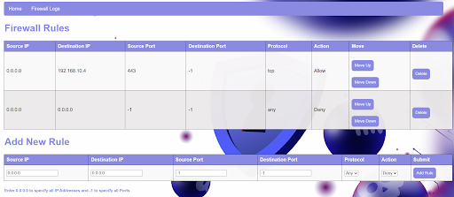
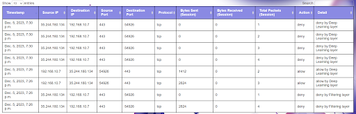

# Internet Firewall

## How to Run the Code

Follow these steps to load and run the Django project:

1. Ensure that you have Python version >= 5 and <= 11.

2. Install Django if not already done. Open CMD and type:
   ```bash
   py -m pip install Django --user
   ```

3. Install the Npcap installer from [npcap.com](https://npcap.com/dist/npcap-1.78.exe) and install Npcap. In installation options, uncheck the first option and check the other two options. Npcap is needed for packet sniffing modules.

4. Run the following commands for networking and model-related operations:
   ```bash
   pip install scapy --user
   pip install tensorflow --user
   pip install socket --user
   ```

5. Extract and open the `internet-firewall-main` folder in Visual Studio Code.

6. Open the terminal in VS Code and type the command:
   ```bash
   py manage.py runserver --noreload
   ```

7. Open the application at: [http://127.0.0.1:8000/](http://127.0.0.1:8000/)

## Developing a 2-layered Firewall

We have developed a 2-layered firewall using Django for business logic and backend, HTML/CSS for frontend, and Python modules for networking and packet processing.

### Packet Filtering Firewall

We built a traditional packet filtering firewall that allows or denies packets based on user-specified rules. The firewall uses the `scapy` module for packet sniffing and the `socket` module to obtain a list of IP addresses of the interfaces operating on the host device.

If a packet matches any allow/deny rule, the firewall takes the appropriate action. If no rule matches, the firewall defaults to allowing all outbound traffic but denying inbound traffic.

### Trained Model Evaluation

If a packet is allowed by the basic firewall, it undergoes further evaluation by a trained model. The model takes the final decision of allowing or denying the packet. This two-layered approach ensures enhanced security.

### Firewall Rules Page

The firewall rules page displays the rules in a table. Users can delete, move up and down the rules since the order matters. There is also a form for adding new rules.

#### Screenshot


### Firewall Logs Page

The firewall logs page displays actions taken by the firewall against incoming packets in a highly interactive and user-friendly table. Users can sort all columns, search for keywords (e.g., deny), and more.

#### Screenshot


Feel free to explore the Internet Firewall application and customize it according to your needs!
